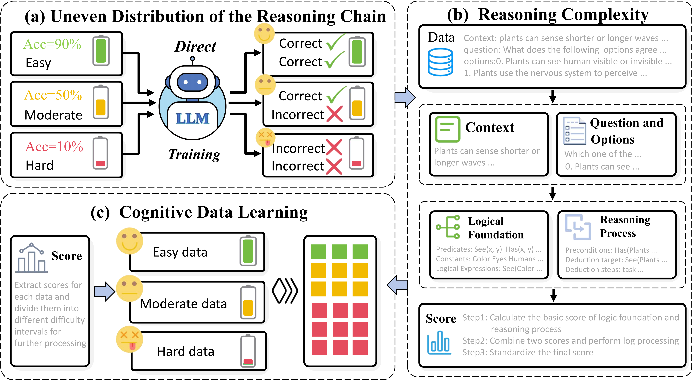

<h1 align="center"> RE </h1>
<h3 align="center"> Exploration via Reasoning Estimator </h3>

<p align="center">
  <a href="xxx">📄arXiv</a> •
  <a href="xxx/">🌐Web</a> •
    <a href="xxx">𝕏 Blog</a>
    •
    <a href="xxx">🤗 HF</a> •
    <a href="xxx">🎧NotebookLM Audio</a>


  
</p>

[](https://github.com/HuzhouNLP/Exploration-via-Reasoning-Estimator) 
[](https://opensource.org/licenses/MIT)
 

## Table of Contents

- 🌻[Acknowledgement](#acknowledgement)
- 🌟[Overview](#overview)
- 🔧[Installation](#installation)
- 📚[Logical Element Extraction and Score Calculation](#logical-element-extraction-and-Score-Calculation)
- 📉[Model Training](#model-training)
- 🧐[Evaluation](#evaluation)
- 🚩[Citation](#citation)

---


## 🌻Acknowledgement

Our code for the training module and the inference module is implemented based on [TRL](https://github.com/huggingface/trl). The training and test datasets are sourced from [Reclor](https://github.com/yuweihao/reclor), [LogiQA](https://github.com/lgw863/LogiQA-dataset), [LogiQA2.0](https://github.com/csitfun/LogiQA2.0), and [LogicBench](https://github.com/Mihir3009/LogicBench). Thanks for their great contributions! 




## 🌟Overview

Recent advances in large language models (LLMs) highlight the importance of training data structure and quality in shaping reasoning behavior. However, most existing approaches focus on transforming data formats while neglecting the internal reasoning complexity of training samples, leaving the reasoning potential of data underexplored and underutilized. In this work, we posit that LLM reasoning performance is bounded by both the reasoning potential of data and the cognitive capacity of the model. Inspired by the Information Bottleneck principle, we propose data reasoning intensity, a novel metric that quantifies the latent reasoning complexity of samples by decomposing and aggregating their logical structures. This allows us to analyze how well current models utilize reasoning signals and identify performance gaps relative to data potential. Based on this insight, we introduce a Re-Cognizing optimization strategy that systematically enhances the reasoning intensity of training data. Rather than increasing data volume, our method re-optimizes existing samples to better align with the model’s reasoning frontier. Experiments on multiple logical reasoning benchmarks show that our approach significantly improves performance and generalization over data-centric strategies. We further validate our method under a reinforcement learning framework. Our findings suggest that optimizing data for reasoning complexity—rather than scale or surface structure—is key to unlocking the full cognitive potential of LLMs.


## 🔧Installation

```bash
git https://github.com/HuzhouNLP/Exploration-via-Reasoning-Estimator
cd Exploration-via-Reasoning-Estimator
pip install -r requirements.txt
```

TRL install

```bash
pip install trl
```

## 📚Logical Element Extraction and Score Calculation

To process data
```sh
python ./score_calculate/data_process/1.logiQA.py
python ./score_calculate/data_process/2.logiQA2.0(MCQA).py
python ./score_calculate/data_process/3.reclor.py
python ./score_calculate/data_process/4.logicBench(Aug).py
python ./score_calculate/data_process/4.logicBench(Eval).py
```

To extract the logical element
```sh
python ./score_calculate/context_extract.py
python ./score_calculate/options_extract.py
```

To calculate the score
```sh
python ./score_calculate/final_score_all_data_calculate_LayerNorm_Sigmoid.py
python ./score_calculate/score_all.py
python ./score_calculate/extraction_final_chart.py
```

If you wish to extract data based on the score ratio
```sh
python ./score_calculate/filter_test_data_every_interval.py
```

If you want to calculate the error rate
```sh
python ./score_calculate/interveal_error_data.py
```

## 📉Model Training

Using TRL framework to train model
```sh
# If you want to train directly
python ./Our_way/train/direct_trainingDirect_training.py

# If you want to use curriculum learning method for training
python ./Our_way/train/curriculum_learning.py

# If you want to use the bin-based progressive learning method for training
python ./Our_way/train/bin-based_progressive_learning.py

# If you want to use our method for training
python ./Our_way/train/our_way.py
```

## 🧐Evaluation


To evaluate the task, you need to place your model and lora parameters in a designated location, which can be pointed to by adjusting the position in the file
```sh
# If you only have one original test set file to evaluate
python ./Our_way/eval/our_way.py

# If you only have one balanced test set file to evaluate
python ./Our_way/eval/Balanced_test.py

# If you have multiple original test set files that need to be evaluated
bash ./Our_way/eval/TRL-submit_all.sh

# If you have multiple balanced test set files that need to be evaluated
bash ./Our_way/eval/TRL-sig-submit_all.sh
```

After obtaining the results, in order to calculate the accuracy
```sh
python ./Our_way/eval/comprehensive_processing_accuracy_compute.py

# You can also create it as an Excel spreadsheet
python ./Our_way/eval/json_to_excel.py
```

To calculate the error rate
```sh
# If you only have one file
python ./Our_way/eval/error_rate_calculation_one.py

# If you have multiple files
python ./Our_way/eval/error_rate_calculation_multi.py
```

## 🚩Citation

Please cite our repository if you use WKM in your work. Thanks!

```bibtex

```


## 🎉Contributors


We will offer long-term maintenance to fix bugs and solve issues. So if you have any problems, please put issues to us.
